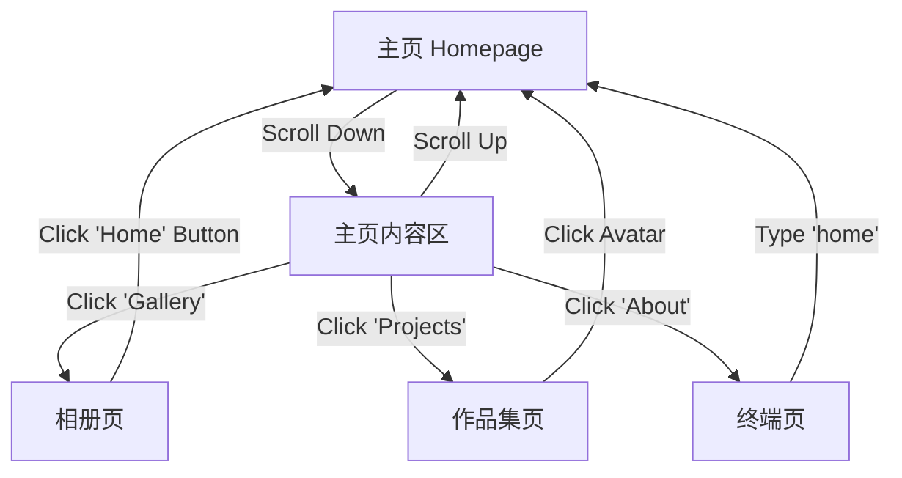

# 产品需求文档 (PRD): The Page 重构与升级

## 1. 项目概述 (Project Overview)
**The Page** 是一个集成了个人主页、作品集、在线相册和终端风格介绍页的综合性个人网站。当前项目由四个独立的子工程组成（Homepage, Gallery, Projects, About）。

本次迭代的目标是**统一项目体验**，实现各子模块间的无缝导航，并在保留原有视觉效果的前提下，优化架构以支持 GitHub Pages 的统一已部署，并未未来扩展奠定基础。

## 2. 核心需求 (Core Requirements)
1.  **统一导航与闭环**：所有子页面（Gallery, Projects, About）必须能顺畅跳转回主页，消除“死胡同”页面。
2.  **交互体验升级**：优化主页滚动逻辑，使其更符合现代浏览习惯。
3.  **工程化重构**：确保所有模块（特别是 Gallery）拥有可维护的源码，并能统一构建部署到 GitHub Pages。
4.  **复现与保持**：在重构过程中，必须 1:1 保持原有的视觉效果（特别是 Gallery 的动效和 About 的终端风格）。

## 3. 核心功能 (Core Features)

### 3.1 Homepage (主页)
*   **双屏滚动优化**：
    *   **现状**：只能从首屏 Intro 向下滚动到 Main，无法自由回滚。
    *   **新功能**：实现**全屏滚动（Fullpage Scroll）**或**双向平滑滚动**，允许用户自由地在“Intro（首屏）”和“Main（内容屏）”之间上下切换。

### 3.2 Gallery (相册 - AnimatedGallery)
*   **源码接管**：弃用原有的静态编译文件，全面启用 `AnimatedGallery-main` 作为源码基准。
*   **返回主页入口**：
    *   在相册页面右上角（或合适位置）增加 **"Home"** 按钮。
    *   **样式要求**：复用 Homepage 的设计风格（如下划线动画、字体、图标风格），确保视觉一致性。

### 3.3 Projects (作品集 - FolioSpace)
*   **返回主页入口**：
    *   为 `Sidebar` 组件中的 **Avatar Section (头像区域)** 添加点击交互。
    *   **行为**：点击头像区域直接跳转回主页 (`/`)。

### 3.4 About (终端页)
*   **自定义命令 expansion**：
    *   在现有命令集（如 help, ls 等）中新增 `home` 命令。
    *   **行为**：用户输入 `home` 并回车后，执行 JS 跳转回主页。

## 4. 核心组件 (Core Components)

| 模块 | 组件名 | 变更描述 |
| :--- | :--- | :--- |
| **Common** | `HomeButton` | 一个复用的、风格统一的返回主页按钮组件（主要用于 Gallery）。 |
| **Homepage** | `ScrollManager` | 虽然主要基于 jQuery/Gulp，需修改 JS 逻辑以支持双向滚动监听 `wheel` 事件。 |
| **Projects** | `SidebarAvatar` | 包装 Link 或 onClick 事件处理程序。 |
| **About** | `CommandParser` | 在 `commands.js` 中注册新的 `home` 指令逻辑。 |

## 5. 应用/用户流程 (User Flow)

## 6. 实施计划 (Implementation Plan)

### 阶段一：源码整合与环境准备
1.  确认 `AnimatedGallery-main` 为 Gallery 源码，并建立开发环境。
2.  配置各子项目的 `publicPath` 或 `base URL`，确保它们在部署到 GitHub Pages 二级目录（如 `/gallery`, `/projects`）时能正常加载资源。

### 阶段二：功能开发 (按模块)
1.  **Gallery 开发**：
    *   提取 Homepage 的按钮样式。
    *   在 Gallery 布局中集成 Home 按钮。
2.  **Projects 开发**：
    *   修改 Sidebar 组件，添加路由跳转。
3.  **About 开发**：
    *   扩展 `commands.js`。
4.  **Homepage 优化**：
    *   重构 JS 滚动监听逻辑，解除单向锁定。

### 阶段三：构建与部署 (Build & Deploy)
1.  编写统一的 **Workflow 脚本**（如 GitHub Actions 或本地 shell 脚本）。
2.  **构建策略**：
    *   Homepage -> `root`
    *   Gallery (build) -> `root/c/gallery`
    *   Projects (build) -> `root/c/projects`
    *   About (build) -> `root/c/about`
3.  验证所有静态资源链接有效性。

---
*Created by Antigravity under user instruction.*
